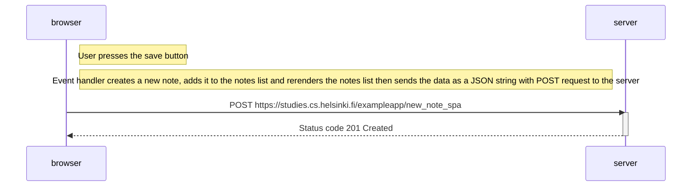

```mermaid
sequenceDiagram
    participant browser
    participant server

    Note right of browser: User presses the save button
    Note right of browser: Event handler creates a new note, adds it to the notes list and rerenders the notes list then sends the data as a JSON string with POST request to the server
    browser->>server: POST https://studies.cs.helsinki.fi/exampleapp/new_note_spa


    activate server
    server-->>browser: Status code 201 Created
    deactivate server


```
